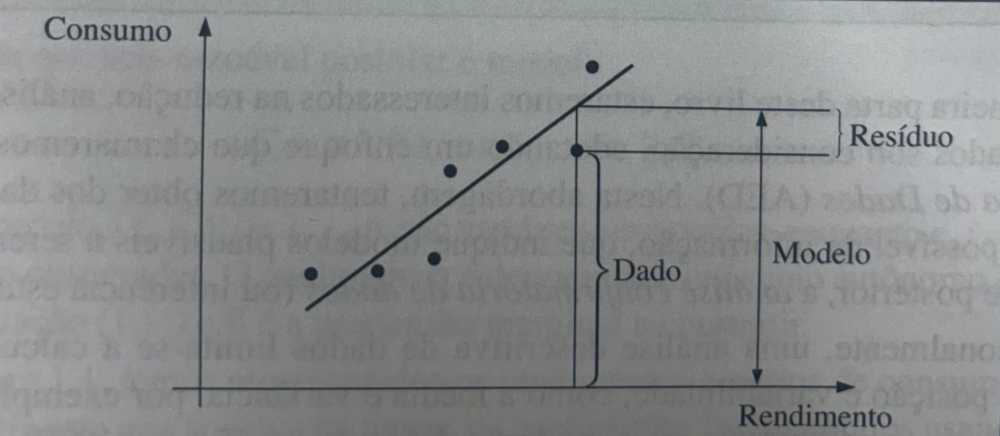

# Introdução

Vamos começar com algumas definições, para entender como diversos autores enxergam a área.

> Estatística é a ciência que utiliza as teorias probabilísticas para explicar a frequência da ocorrência de eventos, tanto em estudos observacionais quanto em experimentos para modelar a aleatoriedade e a incerteza de forma a estimar ou possibilitar a previsão de fenômenos futuros, conforme o caso. ([Wikipedia](https://pt.wikipedia.org/wiki/Estat%C3%ADstica))

> A Estatística é a parte da metodologia da Ciência que tem por objetivo a coleta, redução, análise e modelagem dos dados, a partir do que, finalmente, faz-se a inferência para uma população da qual os dados (a amostra) foram obtidos. (Bussab, 2017)

> Estatística é a ciência que nos ajuda a tomar decisões e a tirar conclusões na presença de variabilidade. (Montgomery, 2021)

Vamos seguir maior parte do programa e definições apresentados no livro de Montgomery. 

Qual o papel de um engenheiro(a) nisso? Um engenheiro é alguém que resolve problemas de interesse da sociedade, pela aplicação eficiente de princípios científicos. Então precisamos entender bem o método científico e a estatística está fortemente presente nele.

Vemos que um ponto central é a *variabilidade*, também existe uma definição para ela:

> Métodos científicos são usados para nos ajudar a entender variabilidade. Por variabilidade, queremos dizer que sucessivas observações de um sistema ou de um fenômeno não produzem exatamente o mesmo resultado.

Veja que é diferente do esperado, por exemplo, pelo conceito de função matemática *determinística*: $f(x) = x^2$ ou algo como $f(x) = \int_{0}^{x} ln(k)*e^(k) dk$. Sempre que você for computar com um mesmo valor de $x$ o resultado sairá igual. Não é a mesma coisa quando se tem uma natureza *estocástica*, ou seja, indeterminada.

Um exemplo disso é na observação do desempenho do consumo em cada tanque de combustível, no caso de um automóvel. A variabilidade é apresentada em decorrência de muitos fatores, como:
- Tipo de estrada
- Condição do veículo (desgaste do pneu, compressão do motor, desgaste da válvula...)
- Condições climáticas
- Outras condições não modeladas

A área que vai nos ajudar a definir formalmente (e com isso permitir usá-la como ferramenta) a variabilidade é a Probabilidade. Por isso, nosso assunto, depois desta introdução, será ela.

# Nomenclaturas/jargões da área

## O mundo ideal em um modelo

O mundo que vivemos é complicado demais. Um modelo é uma simplificação da realidade, construída com um objetivo.

Usamos ferramentas conhecidas para montar modelos:
- Equações matemáticas
- Diagramas
- Grafos

> Resolver um modelo é obter respostas para o problema a ele associado (Boaventura, 2017)

## Como a variabilidade pode entrar em modelos

Muito da educação formal de engenheiros envolve o aprendizado de modelos relevantes para técnicas e campos específicos de aplicação dos mesmos na formulação e solução de problemas.
Exemplo: Na mediçao da corrente em um fio fino de cobre, podemos usar a Lei de Ohm:

$$I = \frac{V}{R}$$

Esse modelo é construído a partir de nosso conhecimento do mecanismo físico básico que relaciona essas variáveis. Mas medições reais podem diferir *levemente* por causa de pequenas mudanças e fatores que não estejam completamente controlados como:
- Mudança de temperatura
- Flutuações do desempenho do medido (o curso terá a disciplina de Instrumentação Eletrônica)
- Impurezas presentes em diferentes localizações do fio
- Impulsos de voltagem

Podemos tentar trazer essas contribuições para a equação, mas poderia ser um esforço alto para pouca vantagem, se a variação for leve. Nesse caso, poderíamos propor:

$$I = \frac{V}{R} + \varepsilon$$

Em que $\varepsilon$ é uma pertubação aleatória. Agora $I$ é considerada uma *variável aleatória*.

No livro do Bussab/Morettin, tem-se o seguinte esquema:

$$\text{DADOS} = \text{MODELO} + \text{RESÍDUOS}$$

## Populações e amostras

Modelos podem vir de leis físicas e relações conhecidas, descrevendo o caminho de leis gerais para casos específicos. Outra forma de raciocinar é a partir de um conjunto específico (*amostra*) para casos gerais (*população*). Esse processo é conhecido como *inferência estatística*.

## Tipos de coleta

Vamos considerar o problema de selecionar uma amostra de alguma população. Para isso, vamos trazer três metodologias:

- Estudo retrospectivo
- Estudo de observação
- Experimento controlado

## Probabilidade e Modelos de probabilidade

> Modelos de probabilidade ajudam a quantificar os riscos envolvidos em inferência estatística, isto é, os riscos envolvidos em decisões feitas todo dia.

# Referências

- **BOAVENTURA, P. O.; JURKIEWICZ, S.** Grafos: Introdução e Prática. 2. ed. São Paulo: Blucher, 2017.
- **BUSSAB, W. O.; MORETTIN, P. A.** _Estatística Básica._ 9. ed. São Paulo: Saraiva, 2017.
- **MONTGOMERY, D. C.; RUNGER, G. C.** _Estatística Aplicada e Probabilidade para Engenheiros._ 7. ed. Rio de Janeiro: LTC, 2021.
