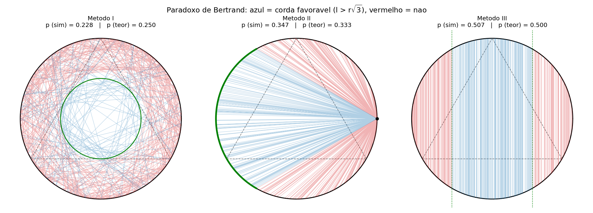
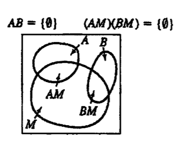
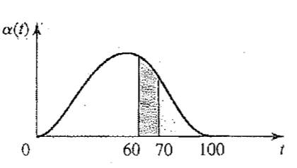
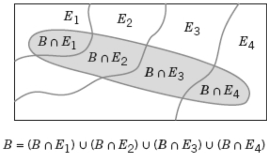

# Definições de probabilidade

O início do livro *Probability, Random Variables, And Stochastic Processes* (4 ed.) do Papoulis (1921), Pillai (2002) diz:
> The theory of probability deals with averages of mass phenomena occurring sequentially and simultaneously, e.g. electron emission, system failure, turbulence, among many others. It has been **observed** that in these and other fields certain averages **approach a constant value** as the number of observation increases and this value remains the same (...).

Nosso objetivo é compreender, quantificar e modelar o tipo de variações que encontramos com frequência.

## Espaços amostrais e eventos

> Definição: Um experimento que pode fornecer diferentes resultados, embora seja repetido toda vez da mesma maneira, é chamado de experimento aleatório.

### Espaço amostral
> Definição: O conjunto de todos os resultados possíveis de um experimento aleatório é conhecido como espaço amostral do experimento. O espaço amostral é denotado por $S$.

Exemplo da Câmera Flash: Experimento que registra o tempo de recarga de um flash 
- Tempo de recarga do flash 
- Limitações entre 1,5 e 5 segundos
- Análise se tempo é baixo, médio ou alto
- Análise se câmera satisfaz um requisito mínimo (_threshold_)

💡A melhor escolha de um espaço amostral depende dos objetivos do estudo

### Eventos
> Definição: Evento é um subconjunto do espaço amostral de um experimento aleatório.

- A união de dois eventos é o evento que consiste em todos os resultados que estão contidos em cada um dos dois eventos. Denotamos a união por $E_1 \cup E_2$.
- A interseção de dois eventos é o evento que consiste em todos os resultados que estão contidos nos dois eventos, simultaneamente. Denotamos a interseção por $E_1 \cap E_2$. 
- O complemento de um evento em um espaço amostral é o conjunto dos resultados no espaço amostral que não estão no evento. Denotamos o complemento do evento $E$ por $E'$ ou $E^c$.

Algumas situações especiais
- Como $E \subseteq S$, temos o evento de acontecimento certo $E = S$ e o evento impossível $E = S^c = \varnothing$
- Eventos excludentes $E_1 \cap E_2 = \varnothing$

## Definição baseada na frequência relativa

A probabilidade $P(E)$ de um evento $E$ é o limite:
$$P(E) = \lim_{n \rightarrow \infty} \frac{n_e}{n}$$
Em que $n_e$ é o número de ocorrências de $E$ e $n$ é o número de tentativas.
Essa abordagem pode ser usada apenas como hipótese, mas não como base de construção da teoria probabilística, por mais que sejam feitos muitos experimentos.

Problema: Vamos fazer um paralelo com a definição de uma resistência $R$. Podemos usar o limite:
$$R = \lim_{n \rightarrow \infty} \frac{v(t)}{i_n (t)}$$
Em que $v(t)$ é uma fonte de tensão e $i_n(t)$ são as correntes de uma sequência de resistores reais que tendem a um elemento (de dois terminais) reais.

🧮 A teoria resultante é complexa demais, melhor usar uma abordagem axiomática baseada nas leis de Kirchoff.

## Definição clássica

A probabilidade $P(E)$ de um evento $E$ é determinada, a priori, sem experimentação, a partir da razão:
$$P(E) = \frac{N_E}{N}$$
Em que $N$ é o número de resultados possíveis *(dispostos de maneira igualmente apresentadas)* e $N_E$ é o número de resultados favoráveis para o evento $E$.

⚠️ O problema desta abordagem é a possibilidade de ambiguidade.

**Resultados igualmente prováveis**: Toda vez que um espaço amostral consistir em N resultados possíveis que forem igualmente prováveis, a probabilidade de cada resultado é 1/N.

**Probabilidade de um evento em espaço amostral discreto**: Para um espaço amostral discreto, a probabilidade de um evento $E$, denotada por $P(E)$, é igual à soma das probabilidades dos resultados em $E$.

Exemplo: A partir de um silo com 50 itens, seis deles são selecionados aleatoriamente sem reposição. O silo contém três itens defeituosos e 47 não defeituosos. Qual é a probabilidade de que exatamente dois itens defeituosos sejam selecionados na amostra?
Precisamos de algum mecanismo para resolver isso, para isso, como se trata de um espaço discreto, vamos recorrer a alguma técnica de contagem. Depois voltamos para ele.

# Técnicas de contagem

Vamos resolver o problema do *dispostos de maneira igualmente apresentada* da definição clássica.
💡Para isso, vamos usar combinatória.

**Regra da multiplicação**: Considere que uma operação possa ser descrita como uma sequência de k etapas, em que $n_i$ é o número de maneiras de completar a etapa $i \in [1, k]$. Então:
$$n_{total} = n_1 \times n_2 \times \cdots \times n_k $$

**Permutações**: Número de sequências ordenadas dos elementos de um conjunto. Seja $n$ o número de elementos diferentes do conjunto, o número de permutações será:
$$n! = n \times (n-1) \times (n-2) \times \cdots \times 2 \times 1$$

Uma propriedade interessante do fatorial (!) é a recursão.

**Permutações de subconjuntos**: O número de permutações de subconjuntos de r elementos selecionados de um conjunto de $n$ elementos diferentes é:
$$P_r^n = n \times (n-1) \times \cdots \times (n - r + 1)$$

**Permutações de objetos diferentes**: O número de permutações de $n = n_1 + n_2 + ... + n_r$ objetos dos quais $n_1$ são de um tipo, $n_2$ são de um segundo tipo, ..., e $n_r$ são de $r$-ésimo tipo é:
$$\frac{n!}{n_1! n_2! \cdots n_r!}$$

**Combinações**: O número de combinações, subconjuntos de tamanho $r$ que podem ser selecionados a partir de um conjunto de $n$ elementos:
$$C_r^n = \begin{pmatrix}n \\ r \end{pmatrix} = \frac{n!}{r!(n-r)!}$$

Exemplo: Um silo com 50 itens fabricados contém três itens defeituosos e 47 itens não defeituosos. Uma amostra de seis itens é selecionada a partir dos 50 itens. Os itens selecionados não são repostos. Ou seja, cada item pode somente ser selecionado uma única vez e a amostra é um subconjunto dos 50 itens. Quantas amostras diferentes existem, de tamanho seis, que contêm exatamente dois itens defeituosos?

Exemplo: Uma placa de circuito impresso tem oito localizações diferentes em que um componente pode ser colocado. Se quatro componentes diferentes forem colocados na placa, quantos projetos diferentes serão possíveis? 

Exemplo: Um componente pode ser colocado em oito localizações diferentes em uma placa de circuito impresso. Se cinco componentes idênticos forem colocados na placa, quantos projetos diferentes serão possíveis?

# Paradoxo de Bertrand

> We are given a circle $C$ of radius $r$ and we wish to determine the probability $p$ that 
the length $1$ of a "randomly selected" cord $AB$ is greater than the length $r\sqrt(3)$ of the 
inscribed equilateral triangle. 

Mostra um questionamento da unicidade da solução da formulação clássica para problemas em que a quantidade de resultados possíveis é infinita. [Artigo na wikipedia](https://en.wikipedia.org/wiki/Bertrand_paradox_(probability))

Dependendo do método usado (_a priori_) para definir a aleatoriedade, pode dar três resultados válidos:
- Ponto medio uniforme no disco: $P = \frac{1}{4}$
- Extremos uniformes na circunferência: $P = \frac{1}{3}$
- Distância uniforme num diâmetro: $P = \frac{1}{2}$

Podemos usar uma simulação computacional e a definição baseada em frequência relativa para *estimar*, para isso montamos um [script com simulação Monte Carlo](./scripts/bertrand_simulacao.py), gerando a seguinte figura:

O problema deste paradoxo é que "seleção ao acaso" precisa ser definida: cada um dos três métodos corresponde a uma forma diferente de sortear a corda — ou seja, a uma distribuição de probabilidade diferente. Não existe uma única resposta "correta"; a resposta depende do mecanismo que gera a corda. (Voltaremos a esse conceito de distribuição de probabilidade mais adiante, e ele vai ajudar a formalizar essa ideia.)

# Axiomas de probabilidade

Axiomas propostos por Kolmogorov (1933).
Probabilidade é um número que é atribuído a cada membro de uma coleção de eventos, a partir de um experimento aleatório que satisfaça as seguintes propriedades:
1. $P(S) = 1$ em que $S$ é o espaço amostral
2. $0 \leq P(E) \leq 1$ para qualquer evento $E$
3. Para dois eventos $E_1$ e $E_2$ com $E_1 \cap E_2 = \varnothing$, temos que $P(E_1 \cup E_2) = P(E_1) + P(E_2)$

# Álgebra da probabilidade
> Do livro do Papoulis/Pillai:
> We roll two dice and we want to find the probability p that the sum of the numbers that show equals 7. 
> (a) We could consider as possible outcomes the 11 sums 
> (b) We could count as possible outcomes all pairs of numbers not distinguishing between the first and the second die 
> ⚠️ outcomes in (a) and (b) are not equally likely
(Emendar solução com a motivação para a afirmação a seguir)

Afirmação: Toda vez que um espaço amostral consistir em $N$ resultados possíveis que forem igualmente prováveis, a probabilidade de cada resultado é $1/N$.
> We must count all pairs of numbers distinguishing between the first and the second die.

Afirmação: Para um espaço amostral discreto, a probabilidade de um evento $E$, denotada por $P(E)$, é igual à soma das probabilidades dos resultados em $E$.

Probabilidade de uma União: $P(A \cup B) = P(A) + P(B) - P(A \cap B)$

Eventos mutuamente excludentes: $E_1 \cap E_2 = \varnothing \Rightarrow P(E_1 \cap E_2) = 0$

Exercício: Como seria $P(A \cup B \cup C)$?
E se os eventos forem mutuamente excludentes?

> Definição: Uma partição $U$ de um conjunto $S$ é uma coleção de conjuntos mutuamente excludentes $A_i$ de $S$ tal que:
> $$A_1 \cup A_2 \cup \cdots \cup A_n = S \quad A_i \cap A_j = \varnothing \quad i \neq j$$
> $$U = [A_1, A_2, \cdots, A_n]$$

Nesse caso, $P(A_1, A_2, \cdots, A_n) = P(A_1) + P(A_2) + \cdots + P(A_n) = P(S) = 1$.

# Probabilidade condicional

> Definição: A probabilidade condicional é um mecanismo de reavaliação de probabilidades, de acordo com a disponibilidade de novas informações.
> $$P(B|A) = \frac{P(A \cap B)}{P(A)}, \quad P(A) > 0$$
> É a probabilidade condicional de B dado A.
---
Exercício: Mostre que probabilidades condicionais seguem os axiomas de probabilidade.

---
Exemplo: Denotamos por $t$ a idade de uma pessoa ao falecer. A probabilidade $t \leq t_0$ é dada por
$$P(t \leq t_0) = \int_0^{t_{0}} \alpha(t)dt$$
Em que $\alpha(t)$ é uma função determinada pelos registros de mortalidade. Assumimos que:
$$\alpha(t) = 3 \times 10^{-9} t^2(100 - t)^2 \quad 0 \leq t \leq 100 \text{ anos}$$
e 0, caso contrário.
Qual é a probabilidade de que uma pessoa vai morrer entre as idades de 60 e 70 anos assumindo que ela estava viva aos 60.

---
# Interseção de eventos

Podemos reescrever a definição de probabilidade condicional para montar a regra da multiplicação:

$$P(A \cap B) = P(A | B) P(B)$$

Exemplo: A probabilidade de que o primeiro estágio de uma operação, numericamente controlada, de usinagem para pistões com alta rpm atenda às especificações é igual a 0,90. Falhas são causadas por variações no metal, alinhamento de acessórios, condição da lâmina de corte, vibração e condições ambientais. Dado que o primeiro estágio atende às especificações, a probabilidade de que o segundo estágio de usinagem atenda às especificações é de 0,95. Qual é a probabilidade de ambos os estágios atenderem às especificações?
(Interpretação prática: Consequentemente, a probabilidade de que cada estágio seja completado com sucesso necessita ser grande para que um pistão atenda a todas as especificações.)

Uma formulação útil é a da regra da probabilidade total:
> Definição: Suponha que $E_1, E_2, /cdots, E_k$ sejam $k$ conjuntos participantes de um partição $U$ de $S$. Então:
> $$P(B) = P(B \cap E_1) + P(B \cap E_2) + \cdots + P(B \cap E_k)$$

---
Exemplo: Suppose box 1 contains $a$ white balls and $b$ black balls, and box 2 contains $c$ white balls and $d$ black balls. One ball of unknown color is transferred from the first box into the second one and then a ball is drawn from the latter. What is the probability that it will be a white ball?
If no ball is transferred from the first box into the second box, the probability of obtaining a white ball from the second one is simply $c/(c+d)$. In the present case, a ball is first transferred from box 1 to box 2 and there are only two mutually exclusive possibilities for this event—the transferred ball is either a white ball or a black ball. Let
**Solução**
$$W = \{\text{transferred ball is white}\} \qquad B = \{\text{transferred ball is black}\}$$

Note that $W$ together with $B$ form a partition ($W \cup B = S$) and

$$P(W) = \frac{a}{a+b} \qquad P(B) = \frac{b}{a+b}$$

The event of interest

$$A = \{\text{white ball is drawn from the second box}\}$$

can happen only under the two mentioned mutually exclusive possibilities. Hence

$$
\begin{aligned}
P(A) &= P\{A \cap (W \cup B)\} = P\{(A \cap W) \cup (A \cap B)\} \\
&= P(A \cap W) + P(A \cap B) \\
&= P(A \mid W)P(W) + P(A \mid B)P(B)
\end{aligned}
$$

But

$$P(A \mid W) = \frac{c+1}{c+d+1} \qquad P(A \mid B) = \frac{c}{c+d+1}$$

Hence

$$P(A) = \frac{a(c+1)}{(a+b)(c+d+1)} + \frac{bc}{(a+b)(c+d+1)} = \frac{ac+bc+a}{(a+b)(c+d+1)}$$

---
Podemos computar um caso especial, que é:
$$P(B) = P(B \cap A) + P(B \cap A^c) = P(B | A) P(A) + P(B|A^c)P(A^c)$$

# Independência

Em um caso especial, $P(B|A) = P(B)$, isso significa que o evento $A$ não afeta a probabilidade de que o resultado de um experimento esteja no evento $B$.

> Para dois eventos: Dois eventos são independentes se qualquer uma das seguintes afirmações for verdadeira:
> - $P(A|B) = P(A)$
> - $P(B|A) = P(B)$
> - $P(A \cap B) = P(A)P(B)$

No caso de múltiplos eventos, podemos usar a última condição:
$$P(E_1 \cap E_2 \cap \cdots \cap E_n) = P(E_1) \times P(E_2) \times \cdots \times P(E_n)$$

---
Trains X and Y arrive at a station at random between 8 A.M. and 8.20 A.M. Train X stops for four minutes and train Y stops for five minutes. Assuming that the trains arrive independently of each other, we shall determine various probabilities related to the times x and y of their respective arrivals.
(a) Specify the experiment and the general probability $P(A \cap B)$
(b) Determine the probability that train X arrives before Y.
(c) Determine the probability that the trains meet at the station.
(d) Assuming that the trains met, determine the probability that train X arrived before train Y.
To do so, we must first specify the underlying experiment.

(a) The outcomes of this experiment are all points $(x, y)$ in the square of Fig. 2-12. The event

$$A = \{X \text{ arrives in the interval } (t_1, t_2)\} = \{t_1 \le x \le t_2\}$$

is a vertical strip as in Fig. 2-12*a* and its probability equals $(t_2 - t_1)/20$. This is our interpretation of the information that the train arrives at random. Similarly, the event

$$B = \{Y \text{ arrives in the interval } (t_3, t_4)\} = \{t_3 \le y \le t_4\}$$

is a horizontal strip and its probability equals $(t_4 - t_3)/20$.

Proceeding similarly, we can determine the probabilities of any horizontal or vertical sets of points. To complete the specification of the experiment, we must determine also the probabilities of their intersections. Interpreting the independence of the arrival times as independence of the events $A$ and $B$, we obtain

$$P(AB) = P(A)P(B) = \frac{(t_2 - t_1)(t_4 - t_3)}{20 \times 20}$$

The event $AB$ is the rectangle shown in the figure. Since the coordinates of this rectangle are arbitrary, we conclude that the probability of any rectangle equals its area divided by 400. In the plane, all events are unions and intersections of rectangles forming a Borel field. This shows that the probability that the point $(x, y)$ will be in an arbitrary region $R$ of the plane equals the area of $R$ divided by 400. This completes the specification of the experiment.

(*b*) We shall determine the probability that train $X$ arrives before train $Y$. This is the probability of the event

$$C = \{x \le y\}$$

shown in Fig. 2-12*b*. This event is a triangle with area 200. Hence

$$P(C) = \frac{200}{400}$$

(*c*) We shall determine the probability that the trains meet at the station. For the trains to meet, $x$ must be less than $y + 5$ and $y$ must be less than $x + 4$. This is the event

$$D = \{-4 \le x - y \le 5\}$$

of Fig. 2-12*c*. As we see from the figure, the region $D$ consists of two trapezoids with
$AB = BC = AC = ABC$ — diagrama de Venn com três regiões alongadas $A$, $B$ e $C$ sobrepostas em um ponto comum central, dentro de um retângulo (espaço amostral).
common base, and its area equals 159.5. Hence
$$P(D) = \frac{159.5}{400}$$

(*d*) Assuming that the trains met, we shall determine the probability that train $X$ arrived before train $Y$. We wish to find the conditional probability $P(C \mid D)$. The event $CD$ is a trapezoid as shown and its area equals 72. Hence
$$P(C \mid D) = \frac{P(CD)}{P(D)} = \frac{72}{159.5}$$
---

# Teorema de Bayes

Iniciamos com a comutatividade da intersecção: $P(A \cap B) = P(B \cap A)$

Thomas Bayes tratou essa questão nos anos 1700 e desenvolveu o resultado fundamental, conhecido como teorema de Bayes.

$$P(A|B) = \frac{P(B|A)P(A)}{P(B)}, \quad P(B) > 0$$

# Variáveis aleatórias

> Uma variável aleatória é uma função que confere um número real a cada resultado no espaço amostral de um experimento aleatório.

> Notação: Uma variável aleatória é denotada por uma letra maiúscula, tal como X. Depois de um experimento ser conduzido, o valor medido da variável aleatória é denotado por uma letra minúscula, tal como x = 70 miliampères.

> Uma variável aleatória discreta é uma variável aleatória com uma faixa finita (ou infinita contável). Uma variável aleatória contínua é uma variável aleatória com um intervalo (tanto finito como infinito) de números reais para sua faixa.

Exemplos de variáveis aleatórias contínuas: 
- corrente elétrica
- comprimento
- pressão
- temperatura
- tempo
- tensão
- peso 
Exemplos de variáveis aleatórias discretas: 
- número de arranhões em uma superfície
- proporção de partes defeituosas entre 1000 testadas
- número de bits transmitidos que foram recebidos com erro