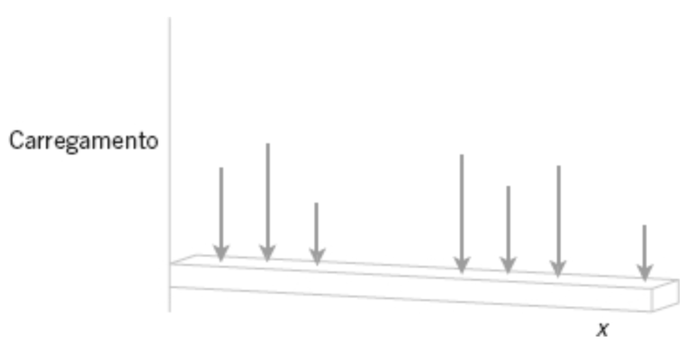
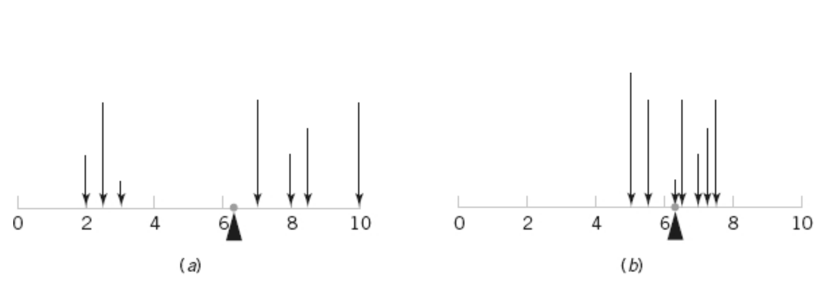

# Motivação

> Definição (Papoulis): We are given an experiment specified by the space $S$ (or $\Omega$), the field of subsets of $S$ called events, and the probability assigned to these events. To every outcome $\xi$ of this experiment, we assign a number $x(\xi)$. We have thus created a function $x$ with domain the set $S$ and range a set of numbers. This function is called random variable if it satisfies certain mild conditions to be soon given.

> Definição (Papoulis): A random variable is a number $x(\xi)$ assigned to every outcome $\xi$ of an experiment. This number could be the gain in a game of chance, the voltage of a random source, the cost of a random component, or any other numerical quantity that is of interest in the performance of the experiment. 

⚠️ Detalhe: O Papoulis usa a abordagem forma $x(\xi)$ ou $x$, já o Montgomery usa simplesmente $X$.

Suponha que um carregamento em uma viga longa e delgada coloque massa somente em pontos discretos. O carregamento pode ser descrito por uma função que especifica a massa em cada um dos pontos discretos.

Podemos trazer essa analogia para descrever uma distribuição de probabilidade em cima de uma variável aleatória discreta $X$.

Antes disso, vamos tentar entender como "modelar" a variável aleatória.

## Exercício
Para cada um dos exercícios seguintes, determine a faixa (valores possíveis) da variável aleatória

3.1.1 A variável aleatória é o número de conexões soldadas não conformes em uma placa de circuito impresso com 1000 conexões.

3.1.2 Uma batelada de 500 peças usinadas contém dez que não atendem aos requisitos do consumidor. A variável aleatória é o número de peças em uma amostra de cinco peças que não atendem aos requisitos do consumidor.

3.1.3 Uma batelada de 500 peças usinadas contém dez que não atendem aos requisitos do consumidor. Peças são selecionadas sucessivamente, sem reposição, até que uma peça não conforme seja obtida. A variável aleatória é o número de peças selecionadas.

3.1.4 A variável aleatória é o número de ciclos do computador requerido para completar um cálculo aritmético selecionado.

3.1.5 A variável aleatória é o número de falhas na superfície em uma grande serpentina de aço galvanizado.

3.1.6 Um grupo de 10.000 pessoas é testado segundo um gene chamado Ifi202, que aumenta o risco de lúpus. A variável aleatória é o número de pessoas que carregam o gene.

3.1.7 Mede-se o número de mutações em uma sequência de nucleotídeos de comprimento 40.000 em um filamento de DNA, depois da exposição à radiação. Cada nucleotídeo pode sofrer mutação.

3.1.8 Uma clínica programa 30 minutos para cada visita de paciente, mas algumas visitas requerem tempo extra. A variável aleatória é o número de pacientes tratados em um dia de oito horas. 

---

Respostas
3.1.1 Faixa: $x \in \{0, 1, 2, \dots, 1000\}$
Explicação: O número de conexões não conformes pode variar de nenhuma até o total exato de conexões disponíveis na placa, que é 1000.

3.1.2 Faixa: $x \in \{0, 1, 2, 3, 4, 5\}$
Explicação: O tamanho da amostra é cinco. Como existem 10 peças não conformes no lote (mais do que o tamanho da amostra), é possível que a amostra contenha de zero a todas as cinco peças com defeito.

3.1.3 Faixa: $x \in \{1, 2, 3, \dots, 491\}$
Explicação: O sucesso pode ocorrer na primeira tentativa (1). O pior cenário (número máximo de tentativas) ocorre se você retirar todas as 490 peças em conformidade do lote primeiro. Nesse caso, a 491ª peça retirada será obrigatoriamente a não conforme.

3.1.4 Faixa: $x \in \{1, 2, 3, \dots\}$
Explicação: Um cálculo requer um número inteiro de ciclos a partir de 1, sem um limite superior rigidamente definido na formulação do problema.

3.1.5 Faixa: $x \in \{0, 1, 2, \dots\}$
Explicação: Uma serpentina pode não ter nenhuma falha ou ter um número finito de falhas sem um limite superior determinado antecipadamente.

3.1.6 Faixa: $x \in \{0, 1, 2, \dots, 10000\}$
Explicação: O número de portadores do gene pode ser de zero até a totalidade das pessoas testadas no grupo de 10.000.

3.1.7 Faixa: $x \in \{0, 1, 2, \dots, 40000\}$
Explicação: Como cada um dos nucleotídeos pode sofrer mutação, o número de mutações vai de zero até o tamanho máximo da sequência, que é 40.000.

3.1.8 Faixa: $x \in \{0, 1, 2, \dots, 16\}$
Explicação: Um dia de trabalho de 8 horas tem 480 minutos. Se o tempo base programado é de 30 minutos, o número máximo absoluto de pacientes que podem ser vistos é 16 ($480 / 30 = 16$). Como algumas visitas requerem tempo extra, o número real pode ser menor que 16, podendo chegar a 0.

---

# Distribuições de Probabilidade

A ideia é que podemos reusar a distribuição que uma variável aleatória é apresentada em um experimento para um outro domínio (ou sistema físico). Reusamos as propriedades e características, por isso é importante entender distribuições conhecidas, como a gaussiana, uniforme, hipergeométrica, entre outras.

> Definição: Distribuição de probabilidades de uma variável aleatória $X$ é uma descrição das probabilidades associadas aos valores possíveis de $X$.

Para uma variável aleatória discreta, a distribuição é frequentemente especificada por apenas uma lista de valores possíveis, juntamente com a probabilidade de cada um.

# Funções de Probabilidade

> Definição: Para uma variável aleatória discreta $X$, com valores possíveis $x_1$, $x_2$, $\cdots$, $x_n$, a função de probabilidade é uma função tal que:
> 1. $f(x_i) \geq 0$
> 2. $\sum_{i=1}^{n} f(x_i) = 1$
> 3. $f(x_i) = P(X = x_i)$

---

**Exemplo:** Seja a variável aleatória X o número de pastilhas de semicondutores que necessitam ser analisadas, de modo a detectar uma grande partícula de contaminação. Considere que a probabilidade de uma pastilha conter uma grande partícula seja 0,01 e que as pastilhas sejam independentes. Determine a distribuição de probabilidades de X.

**Solução:** Seja p uma pastilha em que uma grande partícula esteja presente e seja a uma pastilha em que essa partícula esteja ausente. O espaço amostral do experimento é infinito, podendo ser representado como todas as sequências possíveis que comecem com um conjunto de caracteres de a’s e terminem com p. Ou seja,
$$s = \{ p, ap, aap, \cdots \}$$

Temos que $P(p) = 0.01 \Rightarrow P(a) = 1 - P(p) = 0.99$
Fazemos os casos especiais $P(X = 1) = P(p) = 0.1$ e $P(X = 2) = P(ap) = P(a) \times P(p) = 0.99 \times 0.01$ (pela noção de independência)
Podemos induzir que 
$$P(X = x) = P(aaa\cdots ap) = 0.99^{x-1} \times 0.01$$

Vemos que $f(x) = P(X = x) \geq 0 \ \forall x \in \mathbb{Z}^+ $

Também temos que $\sum_{x=1}^{\infty} f(x)
  = \sum_{x=1}^{\infty} 0.99^{\,x-1} \times 0.01 = 0.01 \sum_{x=1}^{\infty} 0.99^{\,x-1}$

Se colocamos $k = x - 1$, Sobrou uma série geométrica de razão $r = 0.99$. Como $|r| < 1$ a série converge para $\frac{1}{1 - r}$.

Com isso, $\sum_{x=1}^{\infty} f(x) = 0.01 \times \frac{1}{0.01} = 1$

**Interpretação Prática:** O experimento aleatório aqui tem um número ilimitado de resultados, mas ele pode ser convenientemente modelado com uma variável aleatória discreta com uma faixa infinita (contável).

---

# Funções de distribuição cumulativa

Em geral, para qualquer variável aleatória com valores possíveis $x_1$, $x_2$, $\cdots$, $x_n$, os eventos $\{X = x_1\}$, $\{X = x_2 \}$, … são mutuamente excludentes.

> Definição: A função de distribuição cumulativa de uma variável aleatória discreta $X$, denotada por $F(x)$, é:
> $$F(x) = P(X \leq x) = \sum_{x_i \leq x} P(X  = x_i) = \sum_{x_i \leq x} f(x_i)$$

---

**Exercício:** A tabela seguinte mostra a profundidade típica (arredondada para o pé mais próximo) para poços sem falhas em formações geológicas no Condado de Baltimore *(The Journal of Data Science*, 2009, Vol. 7, pp. 111–127).

| Grupo da Formação Geológica | Número de Poços sem Falhas | Profundidade dos Poços sem Falhas (pés) |
|---|---:|---:|
| Gnaisse | 1.515 | 255 |
| Granito | 26 | 218 |
| Xisto Loch Raven | 3.290 | 317 |
| Mineral de silicato | 349 | 231 |
| Mármore | 280 | 267 |
| Xisto | 1.343 | 255 |
| Outros xistos | 887 | 267 |
| Serpentina | 36 | 217 |
| **Total** | **7.726** | — |

Seja $X$ a profundidade de um poço sem falhas escolhido aleatoriamente. Determine a função distribuição cumulativa (FDC) para $X$.

**Solução**

**Passo 1 — Definir as probabilidades pontuais**

Como $X$ é discreta, a probabilidade de cada valor de profundidade é dada pela razão entre o número de poços com aquela profundidade e o total de poços (7.726).

Note que algumas formações compartilham a mesma profundidade, então seus poços devem ser somados:

| Profundidade $x$ (pés) | Poços que contribuem | Nº de poços | $P(X = x)$ |
|---|---|---:|---:|
| 217 | Serpentina | 36 | $36/7726 = 0{,}0047$ |
| 218 | Granito | 26 | $26/7726 = 0{,}0034$ |
| 231 | Mineral de silicato | 349 | $349/7726 = 0{,}0452$ |
| 255 | Gnaisse + Xisto | $1515+1343=2858$ | $2858/7726 = 0{,}3700$ |
| 267 | Mármore + Outros xistos | $280+887=1167$ | $1167/7726 = 0{,}1511$ |
| 317 | Xisto Loch Raven | 3290 | $3290/7726 = 0{,}4259$ |

Verificação: $0{,}0047+0{,}0034+0{,}0452+0{,}3700+0{,}1511+0{,}4259 \approx 1{,}0000$ ✓

**Passo 2 — Acumular as probabilidades**

$$F(x) = P(X \le x) = \sum_{x_i \le x} P(X=x_i)$$

| $x$ | $F(x)$ |
|---|---:|
| 217 | $0{,}0047$ |
| 218 | $0{,}0047+0{,}0034 = 0{,}0080$ |
| 231 | $0{,}0080+0{,}0452 = 0{,}0532$ |
| 255 | $0{,}0532+0{,}3700 = 0{,}4231$ |
| 267 | $0{,}4231+0{,}1511 = 0{,}5742$ |
| 317 | $0{,}5742+0{,}4259 = 1{,}0000$ |

**Passo 3 — Escrever a função distribuição cumulativa**

$$
F(x) =
\begin{cases}
0, & x < 217 \\
0{,}0047, & 217 \le x < 218 \\
0{,}0080, & 218 \le x < 231 \\
0{,}0532, & 231 \le x < 255 \\
0{,}4231, & 255 \le x < 267 \\
0{,}5742, & 267 \le x < 317 \\
1, & x \ge 317
\end{cases}
$$

**Interpretação:** a FDC é uma função "em degraus", constante entre os valores possíveis de $X$ e com um salto em cada profundidade observada, de tamanho igual à probabilidade pontual naquele valor (por exemplo, o maior salto ocorre em $x=317$, refletindo o grande peso do Xisto Loch Raven no total de poços).

---

# Média e Variância

Dois números são frequentemente usados para resumir uma distribuição de probabilidades para uma variável aleatória X. A média é uma medida do centro ou meio da distribuição de probabilidades e a variância é uma medida da dispersão ou variabilidade na distribuição.

Duas distribuições diferentes podem ter a mesma média e variância. Essas medidas são simples e úteis resumos da distribuição de probabilidades de X.

De forma geral, podemos usar a noção de **valor esperado**.

> Definição: Se $X$ é uma variável aleatória discreta com função de probabilidade $f(x)$, o valor esperado de qualquer função $h(X)$ é:
> $$E[h(X)] = \sum_{x}h(x)f(x)$$

## Aplicando na média
Aplicando esse conceito para $h(x) = x$, temos o valor esperado conhecido como média ($\mu$):

$$\mu = E[X] = \sum_{x} x f(x)$$

Vemos que a definição de média, na verdade, segue uma ideia de média ponderada pela função de probabilidade da variável aleatória.

Um exemplo trivial é quando $X$ tem valores igualmente prováveis (dados de 6 lados, distribuição uniforme que vamos ver depois). Nesse caso, se $X$ assume $n$ valores, igualmente prováveis, então $f(x_i) = \frac{1}{n} \quad \forall i = 1, 2, \dots, n$. Assim:
$$E[X] = \sum_{i}^n x_i f(x_i) = \frac{1}{n} \sum_i^{n} x_i$$
Que é a média aritmétrica conhecida.

A média, de forma geral, representa um ponto de equilíbrio da distribuição da variável aleatória. No exemplo da viga, podemos ilustrar:

## Aplicando na variância
Outra medida resumo importante, dessa vez para representar o "espalhamento" ou "dispersão" da variável na distribuição.

Queremos medir o "distanciamento da média" que uma aplicação da variável $X$ tem, então se temos, $x \in X$, dizemos que esse distanciamento é $x - \mu$.

Mas queremos esse valor absoluto, de forma que não haja compensação de um erro positivo com um erro negativo. Então colocamos ao quadrado, assim a nossa função fica $h(x) = (x - \mu)^2$

Aplicando na definição:
$$V(X) = E[(x - \mu)^2] = \sum_{x} (x - \mu)^2 f(x) = \sum_{x} x^2 f(x) - \mu^2 $$

Da mesma forma que fizemos antes, no exemplo trivial de valores de $X$ igualmente prováveis:

$$V(X) = \sum_{i}^n (x_i - \mu)^2 f(x_i) = \frac{1}{n} \sum_{i}^n (x_i - \mu)^2 $$

Para preservar a unidade da variável (que fica ao quadrado na variância), temos a definição de desvio-padrão:
$$\sigma = \sqrt{V(X)}$$

---

Exercício: Uma inspeção visual de uma localização nas pastilhas de um processo de fabricação de semicondutores resultou na seguinte tabela:

| Número de Partículas Contaminadas | Proporção de Pastilhas |
|-----------------------------------|-----------------------:|
| 0                                 |               $0{,}30$ |
| 1                                 |               $0{,}20$ |
| 2                                 |               $0{,}15$ |
| 3                                 |               $0{,}10$ |
| 4                                 |               $0{,}05$ |
| 5 ou mais                         |               $0{,}20$ |

Considere que as pastilhas sejam independentes em relação às partículas contaminadas. As pastilhas são selecionadas até que uma com cinco ou mais partículas contaminadas ocorra. Calcule a média e variância para $X$.

---

# Algumas distribuições

## Distribuição Discreta Uniforme

## Distribuição Binomial

## Distribuição Geométrica e Binomial Negativa

## Distribuição Hipergeométrica

## Distribuição de Poisson

